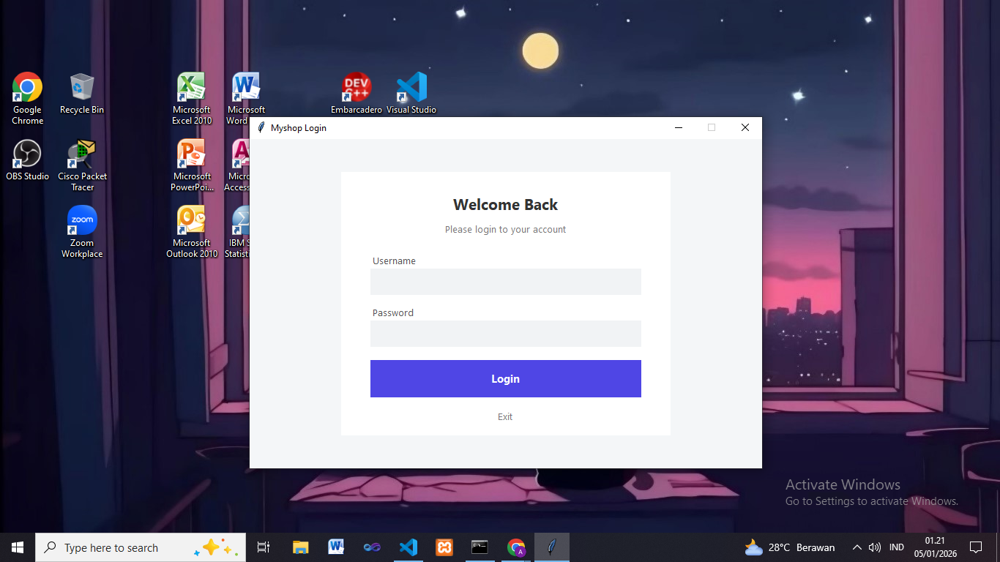
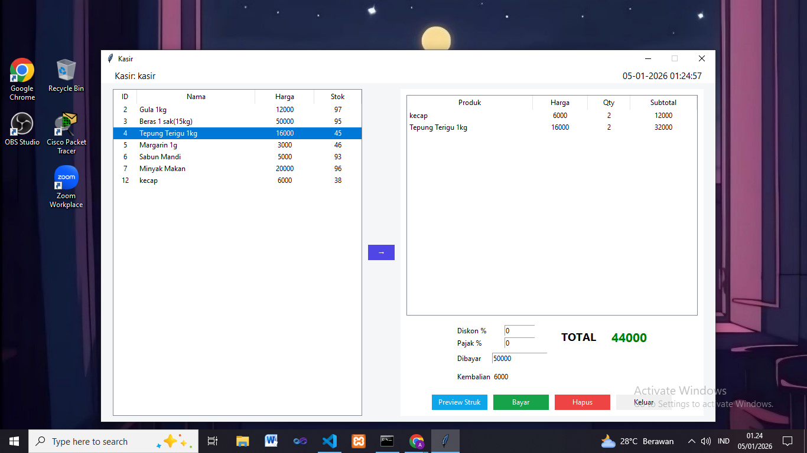
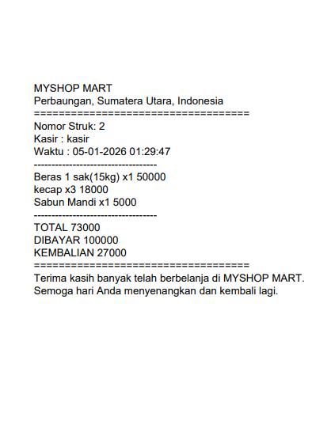

# 🛒 TokoKu

[](https://www.python.org/)
[](LICENSE)

**TokoKu** adalah aplikasi **Point of Sale (POS) Desktop** berbasis Python & Tkinter.
Dirancang untuk memudahkan pengelolaan penjualan, manajemen produk, dan pencetakan struk di toko, minimarket, atau café.

---

## ⚡ Fitur Utama

* Login multi-role: **Manager, Admin, Kasir**
* Manajemen pengguna (Tambah/Ubah/Hapus)
* Daftar produk lengkap dengan stok
* Tambah produk ke keranjang & hitung otomatis
* Diskon & pajak bisa langsung diterapkan
* Input pembayaran & kembalian otomatis
* **Preview struk** sebelum cetak
* Cetak struk PDF
* Reset keranjang & hapus item

---

## 🚀 Instalasi

### 1️⃣ Clone Repository

```bash
git clone https://github.com/akbarpurba/Desktop-App-TokoKu.git
cd Desktop-App-TokoKu
```

### 2️⃣ Buat Virtual Environment (Opsional)

```bash
python -m venv venv
# Windows
venv\Scripts\activate
# macOS / Linux
source venv/bin/activate
```

### 3️⃣ Install Dependencies

```bash
pip install -r requirements.txt
```

### 4️⃣ Jalankan Aplikasi

```bash
python login.py
```

**Akun default:**

| Role    | Username | Password   |
| ------- | -------- | ---------- |
| Manager | manager  | manager123 |
| Admin   | admin    | admin123   |
| Kasir   | kasir    | kasir123   |

---

## 📝 Cara Pakai

### Kasir

1. Pilih produk → klik tombol `→` untuk masuk ke keranjang
2. Masukkan diskon / pajak (opsional)
3. Masukkan jumlah pembayaran
4. Klik `Bayar` → kembalian muncul otomatis
5. Klik `Cetak PDF` untuk struk

### Manager / Admin

1. Login → kelola pengguna
2. Lihat daftar produk & stok

---

## 📸 Screenshot





---

## 💡 Tips

* Gunakan Python ≥ 3.10
* Pastikan file `penjualan.db` berada di folder aplikasi
* Layar besar lebih nyaman untuk kasir

---

## 🛡 Lisensi

MIT License © 2026 **TokoKu**
